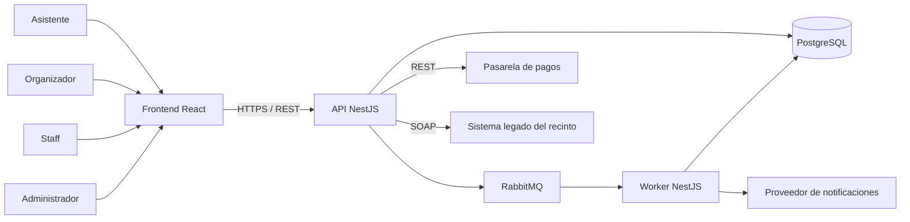
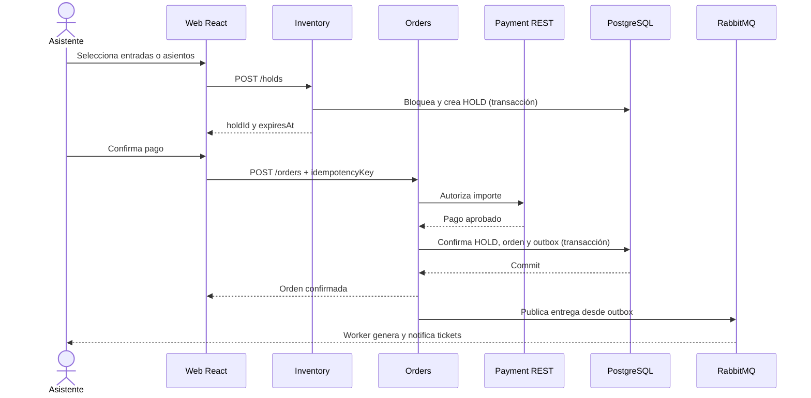
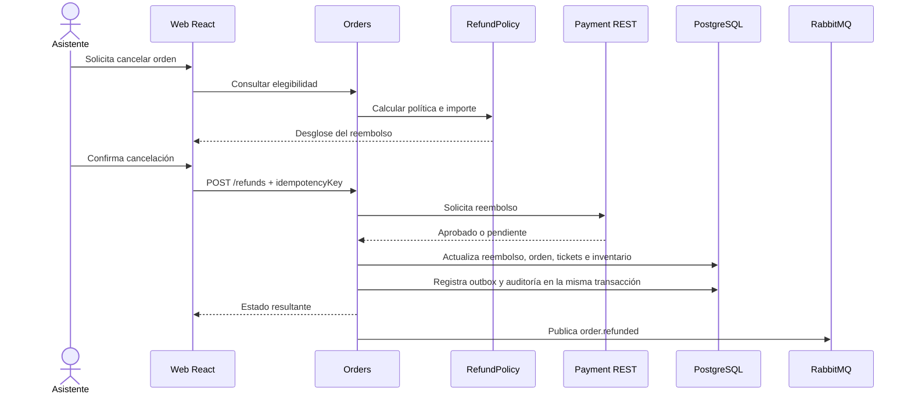

# Arquitectura de EvenHub

## 1. Objetivo

Este documento define una arquitectura técnica mínima, verificable y compatible con los requisitos de `REQUIREMENTS.md` y del TP Integrador. La prioridad es construir un sistema que el equipo pueda implementar, probar y defender; no maximizar la cantidad de servicios o tecnologías.

## 2. Estado de las decisiones

| Decisión | Estado | Motivo |
|---|---|---|
| React + TypeScript + Vite para frontend | Adoptada | Es el stack del prototipo existente. |
| NestJS para backend | Propuesta base | Mantiene TypeScript de punta a punta y está permitido por la cátedra. |
| PostgreSQL | Propuesta base | Ofrece transacciones, restricciones e integridad adecuada para inventario y ventas. |
| TypeORM | Propuesta base | Integración directa con NestJS y soporte de transacciones y migraciones. |
| RabbitMQ | Propuesta base | Resuelve cola punto a punto y publicación/suscripción con un único broker. |
| Monolito modular inicial | Propuesta base | Permite componentes y capas explícitas sin costo operativo prematuro de microservicios. |
| Docker Compose local | Propuesta base | La nube no es obligatoria y el entorno queda reproducible para demos. |
| Pasarela de pagos REST | Pendiente de proveedor | La interfaz será estable aunque el proveedor inicial sea simulado. |
| Sistema de recinto legado SOAP | Pendiente de aprobación docente | Debe confirmarse que el escenario resulta válido y natural para el dominio. |

## 3. Supuestos

- El equipo se siente cómodo trabajando con TypeScript.
- EvenHub será aceptado por la cátedra como dominio propio.
- Los componentes implementados como módulos NestJS con interfaces explícitas satisfacen el concepto de Programación Orientada a Componentes. Esto debe validarse con el docente antes de la primera entrega técnica.
- El despliegue local mediante contenedores es suficiente para las demostraciones.
- La integración SOAP representará provisionalmente un sistema legado de control de acceso o gestión de recinto.
- El frontend puede usar servicios simulados mientras no exista backend, pero la entrega técnica deberá ejecutar componentes e integraciones reales.

## 4. Principios arquitectónicos

1. **Un solo repositorio y pocos procesos.** Frontend, API, base de datos, broker y trabajadores necesarios; nada más hasta que un requisito lo exija.
2. **Componentes por responsabilidad de negocio.** Cada módulo posee su interfaz, reglas y acceso a datos; ningún módulo accede directamente a las tablas privadas de otro.
3. **Capas visibles y defendibles.** Presentación llama a negocio; negocio usa contratos de datos o integración; infraestructura implementa esos contratos.
4. **Consistencia antes que distribución.** Las operaciones locales críticas usan transacciones PostgreSQL. Los efectos externos usan idempotencia y mensajería.
5. **Contratos explícitos.** HTTP se documenta con OpenAPI; SOAP con WSDL; los mensajes tienen nombre, versión y esquema.
6. **Seguridad en el servidor.** El frontend mejora la experiencia, pero nunca es la autoridad sobre permisos, precios, disponibilidad o reembolsos.

## 5. Vista de contexto



## 6. Estilo de arquitectura

### 6.1 Monolito modular

El backend comienza como una aplicación NestJS desplegable con módulos de negocio independientes. Todos comparten una instancia PostgreSQL, pero cada módulo es propietario de sus entidades y repositorios.

No se crearán microservicios por módulo inicialmente. Separar procesos añade despliegues, observabilidad, contratos remotos y fallos distribuidos sin aportar valor al primer incremento.

El worker de RabbitMQ puede ejecutarse como un segundo proceso NestJS porque el consumo asincrónico necesita un ciclo de vida separado. Un módulo solo se extraerá como servicio independiente si:

- la cátedra exige despliegue independiente;
- necesita escalar o fallar de manera distinta;
- posee un contrato estable y datos claramente delimitados;
- existe una medición o restricción que justifica el costo.

### 6.2 Capas por componente

Cada componente implementado conserva tres capas reconocibles:

```text
presentation/     Controllers HTTP, consumidores de mensajes y DTO de entrada
business/         Casos de uso, políticas, validaciones y contratos
data/             Entidades TypeORM, repositorios y migraciones
```

Las integraciones externas viven en `integrations/` dentro del componente que las utiliza e implementan un contrato definido por la capa de negocio.

Reglas de dependencia:

```text
presentation → business → data contract
                         → integration contract

data implementation ─────┘
integration adapter ─────┘
```

- Un controller no ejecuta consultas SQL.
- Un repositorio no contiene reglas de negocio.
- Un módulo no importa el repositorio de otro módulo.
- No se crea una interfaz si solo oculta una clase interna sin frontera de datos, integración o prueba.

## 7. Componentes de negocio

| Componente | Responsabilidad | Interfaz principal | Estado |
|---|---|---|---|
| Identity | Usuarios, autenticación y roles | `authenticate`, `getUser`, `authorizeRole` | Stateless en ejecución; usuarios persistidos. |
| Events | Ciclo de vida del evento, tipos de entrada y políticas | `createEvent`, `publishEvent`, `cancelEvent`, `getPublishedEvent` | Stateless. |
| Inventory | Disponibilidad, sectores, asientos y HOLD | `getAvailability`, `createHold`, `releaseHold`, `commitHold` | Stateful: administra retenciones con vencimiento. |
| Orders | Órdenes, importes y estados | `createOrder`, `confirmOrder`, `getPurchaseHistory` | Stateless con estado persistido. |
| Payments | Autorizaciones y reembolsos contra proveedor REST | `authorizePayment`, `refundPayment`, `getPaymentStatus` | Stateless e idempotente. |
| Tickets | Emisión, QR, descarga y estado del ticket | `issueTickets`, `getTicket`, `cancelTickets` | Stateless con estado persistido. |
| CheckIn | Validación y utilización de tickets | `validateTicket`, `registerCheckIn` | Stateless e idempotente. |
| Favorites | Favoritos por asistente | `addFavorite`, `removeFavorite`, `listFavorites` | Stateless con estado persistido. |
| Notifications | Entrega de comunicaciones y reintentos | `notifyPurchase`, `notifyEventChange`, `notifyRefund` | Consumidor asincrónico. |
| Administration | Consultas administrativas y auditoría | `listUsers`, `listEvents`, `queryAuditLog` | Solo lectura salvo acciones administrativas explícitas. |

Esta división supera el mínimo de seis componentes sin obligar a desplegar diez servicios separados.

## 8. Stateful y stateless

### Componente stateful

`Inventory` es el componente stateful principal porque administra el ciclo de vida de un HOLD:

```text
AVAILABLE → HOLD → SOLD
              └→ AVAILABLE por expiración o abandono
```

El estado no reside únicamente en memoria del proceso. PostgreSQL conserva la retención, sus elementos y `expires_at`; por eso reiniciar una instancia no pierde inventario. Un trabajo periódico libera retenciones vencidas.

### Componentes stateless

Los controllers y servicios de `Identity`, `Events`, `Payments`, `Tickets` y `CheckIn` no dependen de memoria local entre solicitudes. Cualquier instancia puede procesar la siguiente operación consultando PostgreSQL o el proveedor correspondiente.

NestJS administra su ciclo de vida mediante providers y hooks de inicialización/cierre para conexiones, consumidor RabbitMQ y tarea de expiración de HOLD.

## 9. Patrones de diseño

| Patrón | Aplicación | Problema resuelto |
|---|---|---|
| Repository/DAO | Repositorios TypeORM de eventos, órdenes, inventario y tickets | Desacopla reglas de negocio de persistencia. |
| Adapter | `PaymentGatewayAdapter` y `LegacyVenueSoapAdapter` | Uniforma proveedores REST y SOAP detrás de contratos internos. |
| Facade | `CheckoutService` | Coordina HOLD, pago, orden y confirmación mediante una interfaz simple para el controller. |
| Strategy | `RefundPolicy` | Selecciona el cálculo de elegibilidad e importe según política del evento. |
| Factory | Generación de notificaciones o documentos solo si existen variantes reales | No se implementa hasta tener más de una variante que justifique su creación. |

Los tres patrones obligatorios iniciales serán Repository/DAO, Adapter y Facade. Strategy se añade cuando se implemente RF15. Cada patrón debe acompañarse con alternativas descartadas y evidencia en código.

## 10. Estructura objetivo del repositorio

El frontend puede permanecer en la raíz durante su estabilización. Antes de crear el backend se realizará un único movimiento hacia:

```text
EvenHub/
├── apps/
│   ├── web/
│   │   ├── src/
│   │   │   ├── app/
│   │   │   ├── features/
│   │   │   ├── components/shared/
│   │   │   ├── layouts/
│   │   │   ├── services/
│   │   │   ├── styles/
│   │   │   └── types/
│   │   ├── package.json
│   │   └── vite.config.ts
│   └── api/
│       ├── src/
│       │   ├── modules/
│       │   │   ├── identity/
│       │   │   ├── events/
│       │   │   ├── inventory/
│       │   │   ├── orders/
│       │   │   ├── payments/
│       │   │   ├── tickets/
│       │   │   ├── check-in/
│       │   │   ├── favorites/
│       │   │   └── notifications/
│       │   ├── database/
│       │   └── main.ts
│       ├── test/
│       └── package.json
├── docs/
│   ├── diagrams/
│   ├── adr/
│   └── deliveries/
├── infra/
│   └── docker-compose.yml
├── PRODUCT.md
├── DESIGN.md
├── REQUIREMENTS.md
├── ARCHITECTURE.md
├── pnpm-workspace.yaml
└── README.md
```

No se crea un paquete `shared` genérico. Si web y API necesitan compartir contratos, el frontend generará tipos desde OpenAPI; solo se añadirá un paquete cuando exista código realmente compartido.

## 11. Arquitectura del frontend

### 11.1 Responsabilidades

- Renderizar vistas y estados de interacción.
- Aplicar navegación y protección visual por rol.
- Validar formularios para feedback inmediato.
- Cumplir WCAG 2.2 AA mediante semántica, teclado, foco visible, contraste y movimiento reducido.
- Consumir contratos HTTP; nunca decidir precios, disponibilidad, permisos o elegibilidad final.
- Mantener estado local de interfaz y cachear datos remotos cuando exista API.

### 11.2 Estructura por funcionalidad

```text
src/
├── app/                    # Router y providers
├── features/
│   ├── auth/
│   ├── events/
│   ├── favorites/
│   ├── checkout/
│   ├── purchases/
│   ├── tickets/
│   ├── check-in/
│   ├── organizer/
│   └── administration/
├── components/shared/      # Breadcrumb, Toast, Skeleton y controles reutilizados
├── layouts/
├── services/               # Cliente HTTP y adaptadores locales temporales
├── styles/
└── types/
```

### 11.3 Estado

- `useState` para estado visual local.
- Context para sesión y sistema global de toast.
- `localStorage` como persistencia temporal de favoritos durante la fase frontend.
- React Router para URLs navegables y breadcrumbs.
- TanStack Query se incorporará cuando exista API para cache, carga, reintentos e invalidación.
- Redux no se incorpora mientras estos mecanismos cubran los flujos reales.

## 12. Datos

### 12.1 Modelo lógico

| Tabla | Propósito |
|---|---|
| `users` | Identidad, rol y estado del usuario. |
| `events` | Datos y ciclo de vida de eventos. |
| `ticket_types` | Tipos, precios e inventario general. |
| `sectors` | Sectores de un evento con localidades. |
| `seats` | Fila, número, sector y estado estructural. |
| `holds` | Titular, estado y vencimiento de la retención. |
| `hold_items` | Entradas o asientos retenidos. |
| `orders` | Cabecera, importes, usuario y estado. |
| `order_items` | Tipo, asiento, cantidad y precio capturado al comprar. |
| `payments` | Intentos, proveedor, importe, estado e idempotencia. |
| `refunds` | Solicitud, cálculo, proveedor y estado del reintegro. |
| `tickets` | Entrada individual, QR y estado. |
| `favorites` | Relación única entre usuario y evento. |
| `check_ins` | Resultado, operador y fecha de validación. |
| `outbox_events` | Eventos pendientes de publicación confiable. |
| `audit_logs` | Operaciones sensibles y su resultado. |

### 12.2 Reglas de persistencia

- IDs con UUID.
- Fechas almacenadas en UTC y convertidas en la interfaz.
- Dinero como entero en la unidad mínima de la moneda, nunca `float`.
- `favorites` posee restricción única `(user_id, event_id)`.
- QR y claves de idempotencia poseen restricciones únicas.
- Órdenes e items capturan nombre, precio y política relevantes para preservar historia aunque el evento cambie.
- Las migraciones de esquema son versionadas y ejecutadas de manera explícita.

### 12.3 Concurrencia de inventario

Crear un HOLD ejecuta una transacción que:

1. Bloquea las filas de inventario o asientos seleccionados.
2. Verifica disponibilidad efectiva.
3. Crea `holds` y `hold_items` con vencimiento.
4. Confirma la transacción.

Las restricciones de base de datos y el bloqueo transaccional son la defensa principal contra la doble venta; una comprobación del frontend nunca es suficiente.

## 13. API HTTP

La API usa JSON, prefijo `/api/v1` y documentación OpenAPI generada desde NestJS.

### Endpoints públicos y del asistente

```text
POST   /auth/login
GET    /events
GET    /events/:eventId
GET    /events/:eventId/availability
GET    /me/favorites
PUT    /me/favorites/:eventId
DELETE /me/favorites/:eventId
POST   /holds
DELETE /holds/:holdId
POST   /orders
POST   /orders/:orderId/payments
GET    /me/orders
GET    /me/orders/:orderId
POST   /me/orders/:orderId/refunds
GET    /me/tickets
GET    /me/tickets/:ticketId/download?format=pdf|png
```

### Endpoints operativos

```text
POST   /organizer/events
PATCH  /organizer/events/:eventId
POST   /organizer/events/:eventId/publish
POST   /organizer/events/:eventId/cancel
GET    /organizer/events/:eventId/orders
GET    /organizer/events/:eventId/attendees
POST   /staff/events/:eventId/check-ins
GET    /admin/users
GET    /admin/events
GET    /admin/audit-logs
```

### Convenciones de respuesta

- Éxito: código HTTP correcto y recurso o resultado explícito.
- Validación: `400` con errores por campo.
- No autenticado: `401`.
- Sin permiso o propiedad: `403`.
- Recurso inexistente: `404`.
- Conflicto de inventario, HOLD o idempotencia: `409`.
- Regla de negocio no cumplida, como reembolso no elegible: `422`.
- Cada error incluye `code`, `message`, `requestId` y detalles seguros opcionales.

## 14. Integraciones externas

### 14.1 Pasarela moderna REST

Contrato interno:

```ts
interface PaymentGateway {
  authorize(input: PaymentRequest): Promise<PaymentResult>
  refund(input: RefundRequest): Promise<RefundResult>
  getStatus(externalId: string): Promise<PaymentStatus>
}
```

El adaptador traduce estados, errores y credenciales del proveedor al modelo de EvenHub. El modo de demostración implementa el mismo contrato sin red; reemplazarlo no modifica `CheckoutService`.

### 14.2 Sistema legado SOAP

Escenario provisional: un recinto antiguo recibe manifiestos de asistentes y devuelve resultados de sincronización mediante SOAP.

Operaciones candidatas del WSDL:

```text
PublishEventManifest(eventId, attendees)
CancelTicket(ticketCode)
GetManifestStatus(operationId)
```

`LegacyVenueSoapAdapter` encapsula XML, WSDL, timeouts y traducción de errores. El flujo debe seguir funcionando si el sistema legado está temporalmente caído: la sincronización se reintenta de forma asincrónica.

## 15. Mensajería asincrónica

RabbitMQ resuelve los dos modelos obligatorios.

### Cola punto a punto

```text
Queue: ticket.delivery.requested.v1
Producer: Orders
Consumer: Tickets/Notifications worker
```

Una orden confirmada solicita la generación y entrega de tickets. Un único consumidor procesa cada mensaje; los fallos reintentables vuelven a la cola y los definitivos terminan en una dead-letter queue.

### Tópico publicación/suscripción

```text
Exchange: event.lifecycle.v1
Events: event.published, event.rescheduled, event.cancelled
Subscribers: Notifications, Legacy Venue Sync, Administration projection
```

Cada consumidor reacciona de manera independiente. El fallo de una notificación no impide que otro consumidor actualice el sistema legado.

### Contrato mínimo de mensaje

```json
{
  "id": "uuid",
  "type": "event.cancelled",
  "version": 1,
  "occurredAt": "ISO-8601 UTC",
  "aggregateId": "uuid",
  "correlationId": "uuid",
  "payload": {}
}
```

Consumidores y productores usan `id` e idempotencia para evitar efectos duplicados.

## 16. Flujo crítico de compra



La llamada al proveedor de pago no permanece dentro de una transacción de base de datos. Tras su aprobación, una transacción declarativa local confirma el HOLD, la orden y el evento de outbox. Si existe una falla posterior, la idempotencia permite reanudar sin cobrar dos veces.

## 17. Flujo de cancelación y reembolso



Si el proveedor responde de forma asincrónica, la orden queda en `refund_pending`; nunca se muestra como reembolsada antes de la confirmación real.

## 18. Transacciones e idempotencia

### Transacciones declarativas

Los límites iniciales son:

- Crear o liberar un HOLD.
- Confirmar HOLD + orden + outbox después del pago aprobado.
- Marcar ticket usado + registrar check-in.
- Confirmar reembolso + cancelar tickets + restituir inventario + outbox.

TypeORM ejecutará estos casos mediante un transaction manager. Ningún caso realiza llamadas HTTP o SOAP mientras mantiene bloqueos de base de datos.

### Idempotencia

- `POST /orders`, pagos, reembolsos y check-in aceptan una clave de idempotencia.
- La combinación de actor, operación y clave es única.
- Repetir la misma solicitud devuelve el resultado anterior.
- Reutilizar la clave con un payload distinto produce `409 Conflict`.

## 19. Seguridad

### Autenticación

- Contraseñas con hash seguro y salt.
- Access token JWT de duración limitada.
- El refresh token solo se añadirá si la duración de sesión real lo exige.
- Secretos suministrados por variables de entorno y documentados en `.env.example` sin valores reales.

### Autorización

| Operación | Roles y condición |
|---|---|
| Guardar favorito, comprar, consultar orden | Asistente propietario. |
| Crear o editar evento | Organizador propietario. |
| Consultar ventas y asistentes | Organizador propietario. |
| Registrar check-in | Staff autorizado para el evento. |
| Consultar auditoría | Administrador. |
| Ejecutar reembolso | Asistente propietario según política o administrador autorizado. |

NestJS aplica guards declarativos de rol y propiedad. La interfaz puede ocultar acciones, pero el backend repite todas las verificaciones.

### Datos sensibles

- EvenHub no almacena número completo de tarjeta ni CVV.
- Logs excluyen contraseñas, tokens, datos completos de pago y QR utilizables.
- Las descargas de ticket verifican propiedad en cada solicitud.
- SOAP y REST usan timeouts, validación de certificados y credenciales fuera del código.

## 20. Observabilidad y auditoría

El alcance inicial utiliza logs estructurados con:

```text
timestamp, level, service, requestId, correlationId, actorId, action, result
```

No se incorpora una plataforma externa de observabilidad al inicio. Para la demo bastan logs del contenedor, health checks y consultas de auditoría. Métricas y tracing distribuido se añaden cuando existan varios procesos o una necesidad de diagnóstico medible.

Operaciones auditadas:

- autenticación fallida relevante;
- publicación y cancelación de evento;
- autorización y reembolso de pago;
- emisión, cancelación y check-in de ticket;
- cambios administrativos de usuario.

## 21. Pruebas

### Frontend

- Vitest y Testing Library para favoritos persistentes, navegación, selector de asientos, HOLD visible, historial, descarga y reembolso.
- Prueba accesible de navegación por teclado y nombres de controles críticos.
- Una prueba E2E del flujo descubrir → guardar → comprar → consultar orden → descargar ticket.

### Backend

- Pruebas unitarias para disponibilidad, vencimiento de HOLD y políticas de reembolso.
- Pruebas de integración con PostgreSQL para concurrencia de asiento, confirmación transaccional, check-in e idempotencia.
- Pruebas de contrato para adaptadores REST/SOAP y esquemas de mensajes.
- Prueba end-to-end del flujo crítico usando PostgreSQL y RabbitMQ reales en contenedores.

No se persigue cobertura porcentual como objetivo aislado; se prueban especialmente dinero, inventario, seguridad e idempotencia.

## 22. Despliegue local

`docker-compose.yml` ejecutará:

```text
web          React servido para demo
api          NestJS HTTP
worker       NestJS consumidores y expiración de HOLD
postgres     PostgreSQL
rabbitmq     Broker y panel local de administración
```

Durante desarrollo, `web` y `api` pueden ejecutarse fuera de Docker para recarga rápida, mientras PostgreSQL y RabbitMQ permanecen en contenedores.

Health checks mínimos:

- `/health/live`: el proceso responde.
- `/health/ready`: conexiones requeridas disponibles.

## 23. Evolución por entregas

### Etapa frontend

- Completar RF03, RF06, RF11, RF12 y RF15 con servicios locales.
- Incorporar navegación, toast, skeletons, responsive y accesibilidad.
- Mantener los límites de features compatibles con la API futura.

### Primer componente desplegado

- Crear workspace y API NestJS.
- Implementar `Events` en capas con PostgreSQL.
- Documentar interfaz, estado y decisiones.

### Tres componentes, patrones y seguridad

- Añadir `Identity`, `Inventory` y `Orders`.
- Aplicar Repository/DAO, Facade y autorización declarativa.
- Demostrar HOLD stateful y servicios stateless.

### Primer proceso asincrónico

- Incorporar RabbitMQ, outbox y cola de entrega de tickets.
- Demostrar reintento e idempotencia.

### Integración completa

- Incorporar pagos REST, recinto SOAP y tópico de ciclo de eventos.
- Completar transacciones, reembolsos y flujo end-to-end.

## 24. Decisiones aplazadas

- Proveedor real de pagos.
- Proveedor de email/SMS.
- Despliegue en nube.
- Separación de módulos en microservicios.
- Refresh tokens y sesiones multidispositivo.
- CDN o almacenamiento de archivos para tickets.
- Múltiples monedas y reglas fiscales internacionales.

Se decidirán cuando una entrega o una prueba real las vuelva necesarias.

## 25. Riesgos y validaciones pendientes

1. **Aceptación del dominio:** confirmar EvenHub como dominio propio.
2. **Definición de componente:** confirmar que módulos NestJS desplegados en el contenedor cumplen la interpretación de la cátedra.
3. **SOAP natural:** validar el sistema legado de recinto antes de escribir WSDL o adaptadores.
4. **Fechas contradictorias:** confirmar la fecha final entre 30/11 y 21/12.
5. **Políticas de reembolso:** definir si los cargos de servicio se devuelven y cómo se trata una cancelación del evento.
6. **Inventario general y numerado:** decidir qué eventos de demostración usarán cada modalidad.

## 26. Criterio de aceptación arquitectónico

La arquitectura se considera aplicada cuando:

- los módulos y capas existen en el código con dependencias en la dirección definida;
- OpenAPI, WSDL y mensajes reflejan la implementación real;
- PostgreSQL impide doble venta y conserva trazabilidad;
- el flujo de compra y reembolso es idempotente;
- RabbitMQ demuestra una cola y un tópico reales;
- los permisos se validan en backend;
- las decisiones pueden explicarse y demostrarse en vivo por cualquier integrante.
