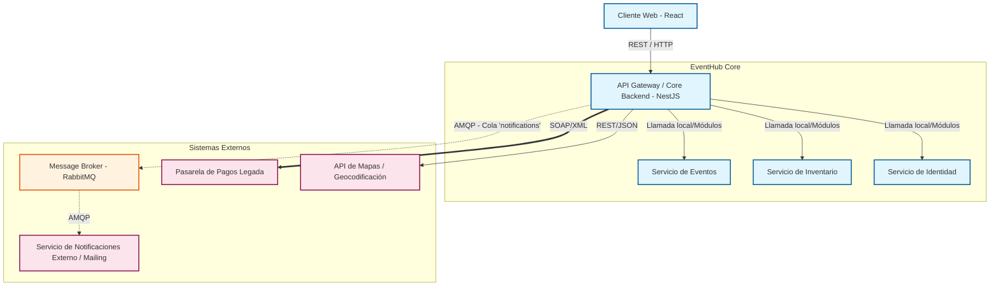

# Entrega Parcial N.º 2

## Diagrama de Arquitectura de Integración (SOA)

A continuación se presenta el diagrama de arquitectura de integración de EventHub, mostrando los componentes internos y los sistemas externos con sus canales de conexión.

### Componentes y Canales
- **Componentes Internos:** La API de NestJS centraliza la lógica de negocio, comunicándose con sus distintos submódulos (Eventos, Inventario, Identidad).
- **Broker de Mensajería (RabbitMQ):** Se utiliza para encolar tareas que no requieren respuesta inmediata (ej. notificaciones).
- **Sistemas Externos:**
  - **Servicio de Notificaciones Externo:** Consume mensajes de RabbitMQ para enviar correos.
  - **Pasarela de Pagos Legada:** Sistema externo conectado vía SOAP para procesar transacciones.
  - **API de Mapas:** Servicio REST moderno para ubicaciones de eventos.

---

## Clasificación Justificada de Integraciones Externas

| Integración Externa | Tipo | Protocolo | Justificación |
| :--- | :--- | :--- | :--- |
| **Servicio de Notificaciones** | **Asincrónica** | AMQP (Cola/Tópico) | El envío de correos o notificaciones (ej. confirmación de compra de entradas) puede tardar y no es vital que el usuario espere a que el mail se envíe para ver la confirmación en pantalla. Utilizar una cola garantiza que si el servicio de correo falla, el mensaje se reintente sin bloquear el flujo principal. |
| **Pasarela de Pagos Legada** | **Síncrona** | SOAP | Se necesita confirmación en tiempo real de si el pago fue aprobado o rechazado para poder liberar o asegurar los tickets en el inventario de manera transaccional. Al ser un sistema "legado" de una entidad bancaria, expone un WSDL. |
| **API de Mapas (Geocoding)** | **Síncrona** | REST | Al crear un evento, la plataforma necesita validar y mostrar la ubicación en el mapa inmediatamente al organizador. Se utiliza REST por ser un estándar moderno en APIs de consumo público. |

---

## Proceso de Negocio Asincrónico: Envío de Notificaciones

**Flujo Implementado (Punta a Punta):**
1. **Acción del Usuario:** Un usuario realiza la reserva de una entrada (o un organizador crea un nuevo evento).
2. **Procesamiento Interno:** El `EventService` o `InventoryService` realiza la operación principal en la base de datos (PostgreSQL).
3. **Publicación de Mensaje:** El backend publica un evento/mensaje en **RabbitMQ** (ej. cola `event_notifications` o un tópico `events.created`).
4. **Respuesta Inmediata:** El cliente web recibe una respuesta rápida de "Operación Exitosa" sin esperar el envío del correo.
5. **Consumo Asincrónico:** Un consumidor (el propio NestJS actuando como microservicio o un worker externo simulado) extrae el mensaje de RabbitMQ y simula el envío del correo electrónico.

*Nota: El broker RabbitMQ está configurado y levantado a través de Docker Compose (`infra/docker-compose.yml`).*
