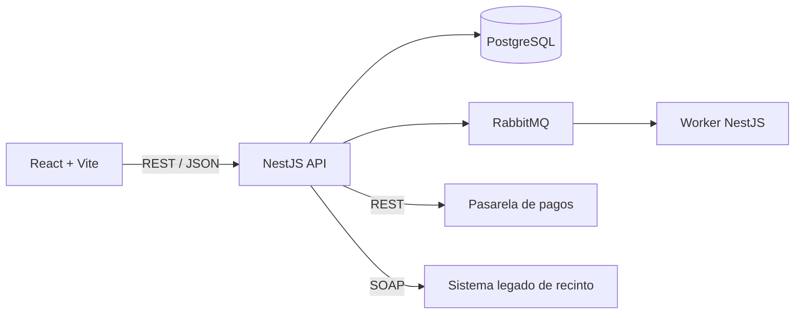

# EvenHub

Plataforma web para vender entradas y administrar eventos. La experiencia principal está orientada al asistente que descubre, guarda y compra eventos; organizadores, staff y administradores disponen de portales operativos según su rol.

> **Estado:** prototipo frontend con datos locales. El backend, la persistencia en base de datos y las integraciones externas están definidos, pero todavía no están implementados.

## Demo

El proyecto permite explorar eventos como visitante o ingresar con perfiles de demostración:

| Perfil | Usuario demo | Funciones actuales |
|---|---|---|
| Asistente | `maria@eventHub.com` | Explorar, comprar y consultar tickets simulados. |
| Organizador | `org@techmadrid.es` | Administrar eventos, ventas, asistentes y check-in. |
| Staff | `staff@eventHub.com` | Validar entradas en un evento. |
| Administrador | `admin@eventHub.com` | Consultar usuarios, organizadores, eventos y auditoría simulada. |

También puede seleccionarse directamente un rol desde la pestaña **Demostración**. En el modo actual, el formulario con credenciales busca el email entre los datos locales y no valida la contraseña; no debe considerarse autenticación real.

## Funciones disponibles

- Página pública, búsqueda, filtros y detalle de eventos.
- Login de demostración por roles.
- Checkout simulado con retención temporal de cinco minutos.
- Generación local de órdenes, tickets y representación visual de QR.
- Consulta de entradas del asistente.
- Creación, edición y eliminación local de eventos del organizador.
- Paneles de ventas, asistentes y métricas.
- Validación simulada de tickets para organizador y staff.
- Portal administrativo con información y auditoría de demostración.

Los datos se cargan desde `src/data/seed.ts` y los cambios viven en memoria. Recargar la aplicación restablece el estado inicial.

## Próximo alcance

Los requisitos aprobados están especificados en [`REQUIREMENTS.md`](./REQUIREMENTS.md). Los siguientes flujos todavía no están implementados:

- Favoritos persistentes y vista `Mis favoritos`.
- Selector accesible de sectores y asientos numerados.
- Estado HOLD visible en el evento.
- Historial y desglose de órdenes.
- Descarga de tickets como PDF o imagen.
- Cancelación y reembolso.
- Breadcrumbs, toast globales y skeleton loaders.
- Confirmación de compra con celebración compatible con movimiento reducido.
- Responsive completo y cumplimiento verificado de WCAG 2.2 AA.
- Backend, PostgreSQL, RabbitMQ e integraciones REST/SOAP.

## Tecnologías actuales

- React 19.
- TypeScript.
- Vite.
- Tailwind CSS 4.
- Oxfmt.
- pnpm.

El backend planificado utiliza NestJS, TypeORM, PostgreSQL y RabbitMQ. Esta arquitectura se incorporará cuando comience la etapa de integración; no forma parte todavía del código ejecutable.

## Requisitos para ejecutar

- Node.js LTS vigente.
- pnpm.

## Instalación

Desde la raíz del proyecto:

```bash
pnpm install
pnpm dev
```

Vite mostrará la URL local de desarrollo en la terminal.

## Comandos

| Comando | Uso |
|---|---|
| `pnpm dev` | Inicia el servidor de desarrollo y lo expone en la red local. |
| `pnpm build` | Verifica TypeScript mediante Vite y genera `dist/`. |
| `pnpm preview` | Sirve localmente el build generado. |
| `pnpm format` | Formatea los archivos soportados con Oxfmt. |
| `pnpm exec tsc --noEmit` | Ejecuta una comprobación explícita de tipos. |

## Estructura actual

```text
EvenHub/
├── src/
│   ├── components/
│   │   ├── public/
│   │   ├── organizer/
│   │   ├── staff/
│   │   ├── admin/
│   │   └── shared/
│   ├── data/
│   ├── App.tsx
│   ├── index.css
│   ├── main.tsx
│   └── types.ts
├── index.html
├── package.json
├── PRODUCT.md
├── DESIGN.md
├── REQUIREMENTS.md
└── ARCHITECTURE.md
```

Cuando comience el backend, el repositorio evolucionará a un workspace con `apps/web`, `apps/api`, `docs` e `infra`. El movimiento se realizará una sola vez para evitar reorganizaciones sin valor durante la etapa frontend.

## Arquitectura objetivo



La decisión base es un monolito modular, no una colección inicial de microservicios. Los módulos permanecen separados por responsabilidad y solo se extraerán si una necesidad real o la cátedra exige despliegue independiente.

## Documentación

- [`PRODUCT.md`](./PRODUCT.md): propósito, usuarios, personalidad y principios del producto.
- [`DESIGN.md`](./DESIGN.md): sistema visual, componentes, accesibilidad y reglas de interfaz.
- [`REQUIREMENTS.md`](./REQUIREMENTS.md): requisitos funcionales, no funcionales y criterios de aceptación.
- [`ARCHITECTURE.md`](./ARCHITECTURE.md): componentes, capas, datos, contratos, seguridad y evolución técnica.
- [Prototipo original en Figma Make](https://www.figma.com/make/h8xncc6mVYtRn61S6zNKQg/Event-Management-System?p=f).

## Convenciones básicas

- Código y nombres técnicos en inglés; interfaz y documentación funcional en español.
- Componentes React en `PascalCase`; funciones y variables en `camelCase`.
- Fechas persistidas en UTC.
- Dinero representado como enteros en la unidad mínima cuando exista backend.
- Secretos únicamente en variables de entorno; nunca en Git.
- Una tarea de Jira por cambio y commits pequeños que reflejen evolución real.

## Validación antes de entregar

```bash
pnpm exec tsc --noEmit
pnpm build
```

Cuando existan pruebas automatizadas se añadirá un script `test` al `package.json`. Hasta entonces, el README no documenta comandos ni resultados inexistentes.

## Uso de inteligencia artificial

El prototipo visual inicial fue generado con el agente de Figma Make. Codex se utilizó para trasladar el prototipo al repositorio local y colaborar en la definición de producto, diseño, requisitos y arquitectura.

Este registro debe actualizarse en cada entrega indicando qué herramienta se utilizó, para qué tarea y qué parte fue revisada y comprendida por el equipo.

## Pendientes académicos

- Confirmar formalmente EvenHub como dominio propio.
- Validar que los módulos NestJS satisfacen la definición de componente usada por la cátedra.
- Aprobar el escenario de integración SOAP con el sistema legado del recinto.
- Resolver la contradicción documental entre las fechas finales 30/11 y 21/12.
